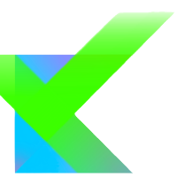
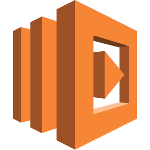
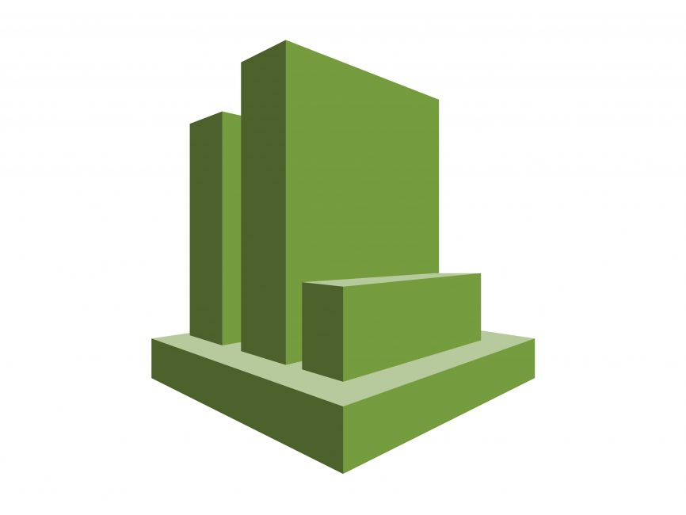
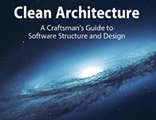
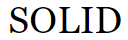
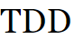

# 👋 Hi guys, I'm Leo!!! 

 

---- 

* I've been Dev Backend for a few years (since 2008)

* From the beginning of my professional career until 2021, I work in the Java world, updating frameworks and new versions of Java (although I have not worked professionally after version 9)

* After 2021 I started working with Kotlin and briefly with Golang (a language that I really like) in addition to having a more effective performance with micro services and AWS

* Main Java/Kotlin frameworks that I have knowledge of are: Spring, Spring-boot, Spring-batch, Micronaut, Hibernate, JPA, Java EE, Itext, JasperReport, JSF and Primefaces

* Database: essentially Oracle and some projects with PostgreSQL and Cassandra. I have knowledge as a study base in MongoDB

* Code design I like some patterns like: Clean Architecture, SOLID and gof designs patterns

* In software development, I highly appreciate the code quality of what I am delivering and this I consider as one of my pillars, I use techniques such as: TDD, unit tests, integration tests, pair programming and code review
  * I did a <a href="https://www.linkedin.com/in/leomachadop/overlay/1615165277292/single-media-viewer/">postgraduate research in Design and Systems Development on Code Review (only in portuguese)</a> in which I could better understand the various benefits that are obtained

* Creating <a href="https://swagger.io/specification/">OpenApi 3</a> and <a href="https://grpc.io/"> gRPC</a> contracts is part of the scope of work I do

* In general, all projects used Scrum as a development methodology, but each location has its own particularities and different objectives

* I had the opportunity to participate in two important regulatory projects in Brazil
  * <a href="https://www.bcb.gov.br/estabilidadefinanceira/exibenormativo?tipo=Circular&numero=3952">Circular 3952</a>, allows commercial establishments to use their receivables in a fractional or full way as collateral in different financial operators to apply for credit
  * <a href="https://openbankingbrasil.org.br/?cookie=true">Open Finance Brazil</a>, will give more freedom of choice through sharing financial data, products and services
  * Participating in these projects was very cool and rewarding, in addition to the benefit it will bring to Brazilian society in order to redemocratize and make credit cheaper
  * I strongly believe that financial inclusion is of great importance in the growth of a country

* I am currently studying two postgraduate courses.
  * <a href="https://online.pucrs.br/pos/financas-investimentos-banking">Finance, investments and banking</a>: The objective is to understand the financial market well and be able to contribute to the companies I work for
  * <a href="https://www.pucminas.br/PucVirtual/Pos-Graduacao/Paginas/Ci%C3%AAncia-de-Dados-e-Big-Data.aspx">Data Science and Big Data</a>: Objective is to learn how to apply knowledge of the financial market in machine learning algorithms and Artificial Intelligence 

* I'm developing a work as a basis for the study of some platforms and languages that I'm interested in, the goal is to be able to apply the knowledge I've been acquiring in the postgraduate courses I'm doing
  * If you want to know more visit: <a href="https://github.com/leomachadop/autonomous-financial-planner">autonomous-financial-planner</a>
  * Every repository that starts with AFP is part of this project

* My biggest career goals are to specialize in the financial market (where I have been working since October 2014), improve my knowledge in AWS and, in the future, be an expert in data applied to the financial market

* My biggest contributions are in private repositories
----

### Programming languages and platforms

### Frameworks

    
    
    

### Tests Frameworks

    
    
    
    
    
    
    

### Integrated development environment (IDE)

    
    
    
    
    
    
    

### Cloud

    

### Containers

    
    

### Cloud components

    
    
    
    
    
    
    

### Monitoring and Observability Tools

    
    
    
    

### Deployment and build tools

    
    
    

### Databases

    
    
    
    

### Agile tools

    
    
    
    
    
    
    
    
    
    
    

### Code management

    
    
    

###  View my stats on Github 

